# Paradigm Cryptocurrency Network

<div align="center">


[](https://github.com/paradigm-network/paradigm/actions)
[](https://github.com/paradigm-network/paradigm/actions)
[](https://docs.paradigm.network)
[](LICENSE)
[](https://discord.gg/paradigm)

**A next-generation cryptocurrency platform with advanced privacy, security, and enterprise features**

[🚀 Quick Start](#quick-start) • [📖 Documentation](#documentation) • [🏗️ Architecture](#architecture) • [🔒 Security](#security) • [🌐 Community](#community)

</div>

---

## 🌟 Overview

Paradigm is a revolutionary cryptocurrency network designed for the modern digital economy. Built with cutting-edge cryptographic techniques, enterprise-grade security, and comprehensive observability, Paradigm offers:

- **🔐 Privacy-First Design**: Zero-knowledge proofs, ring signatures, and stealth addresses
- **🏢 Enterprise Ready**: Multi-signature wallets, compliance monitoring, and audit trails
- **⚡ High Performance**: Optimized for speed with advanced transaction processing
- **🔍 Full Observability**: Real-time monitoring, distributed tracing, and analytics
- **🛡️ Security Focused**: Advanced threat detection and anomaly monitoring
- **🌐 Cross-Chain Ready**: Interoperability with other blockchain networks
- **🤖 AI-Driven Governance**: Advanced machine learning-based consensus and autonomous agents

## 🏗️ Architecture

```mermaid
graph TB
    subgraph "Paradigm Network Architecture"
        subgraph "Core Layer"
            PC[Paradigm Core]
            CS[Consensus Engine]
            TX[Transaction Pool]
            BL[Blockchain]
        end
        
        subgraph "AI Layer"
            AG[AI Governance Agents]
            ML[ML Task Coordinator]
            OPT[Optimization Engine]
            TEV[Temporal Evolution]
        end
        
        subgraph "Security Layer"
            QR[Quantum-Resistant Crypto]
            ZK[Zero-Knowledge Proofs]
            PR[Privacy Engine]
            TH[Threshold Crypto]
        end
        
        subgraph "Application Layer"
            SDK[Paradigm SDK]
            WAL[Wallet Service]
            CON[Contributor Nodes]
            API[REST API]
        end
        
        subgraph "Observability Layer"
            MON[Monitoring System]
            TEL[Telemetry Engine]
            ANL[Analytics Platform]
            DASH[Dashboard]
        end
    end
    
    PC --> CS
    CS --> TX
    TX --> BL
    AG --> ML
    ML --> OPT
    OPT --> TEV
    QR --> ZK
    ZK --> PR
    PR --> TH
    SDK --> WAL
    WAL --> CON
    CON --> API
    MON --> TEL
    TEL --> ANL
    ANL --> DASH
```



### Component Overview

| Component | Description | Technology |
|-----------|-------------|------------|
| **Paradigm Core** | Main blockchain node | Rust, libp2p |
| **AI Governance** | Autonomous decision making | Machine Learning, Neural Networks |
| **Quantum Crypto** | Post-quantum security | Lattice-based, Hash-based algorithms |
| **SDK** | Developer tools | Rust, Python, JavaScript bindings |
| **Monitoring** | Real-time observability | Prometheus, Grafana, OpenTelemetry |

## Key Features

### Core Blockchain Features
- **No Premine**: Fair launch with AI-governed distribution
- **ML-Based Consensus**: Rewards for computational contributions instead of mining
- **Near-Instant Transactions**: Timestamp-based synchronization with quantum-resistant cryptography
- **Autonomous Governance**: AI-controlled reward distribution with human oversight
- **Smart Contracts & Oracles**: Built-in support for autonomous agents
- **Evolving Network**: Self-improving through ML contributions and AI optimization

### Advanced Tokenomics Features
- **AI-Driven Tokenomics Optimization**: Real-time economic parameter adjustment using machine learning
- **Temporal Token Evolution**: Tokens that evolve and adapt based on holder behavior and network participation
- **AI Agent Governance**: Specialized AI agents that participate in governance decisions and learn from human voting patterns
- **Quadratic Voting**: Advanced governance with quadratic voting and conviction-based systems
- **Privacy-Preserving Computation**: Federated learning with differential privacy and secure aggregation
- **Quantum-Resistant Security**: Post-quantum cryptographic algorithms for future-proof security
- **Decentralized Model Hosting**: Distributed marketplace for hosting and serving AI models
- **Network Analytics Dashboard**: Real-time monitoring and analytics with comprehensive insights

## Technical Specifications
- **Currency Symbol**: PAR
- **Decimal Precision**: 8 decimals
- **Initial Supply**: 8,000,000,000 PAR
- **First Year Distribution**: 1,000,000,000 PAR (AI-governed)
- **Transaction Speed**: Near-instant with quantum-resistant signatures
- **Network Type**: Peer-to-peer with ML task coordination and AI governance
- **Consensus**: Proof-of-Contribution with AI optimization
- **Security**: Post-quantum cryptography (Lattice-based, Hash-based, Code-based)

## Advanced Architecture

### AI Agent Governance System
The network features an innovative AI agent governance system with specialized agents:

- **Economic Agents**: Analyze economic proposals and token distribution strategies
- **Technical Agents**: Evaluate technical upgrades and network improvements
- **Community Agents**: Assess community-focused initiatives and social impact
- **Security Agents**: Review security proposals and vulnerability assessments
- **Arbitration Agents**: Resolve disputes and mediate conflicts

#### AI Agent Capabilities
- **Learning from Human Voting**: Agents continuously learn from human voting patterns
- **Consensus Prediction**: Predict proposal outcomes with high accuracy
- **Performance Evolution**: Agents evolve and improve based on prediction accuracy
- **Human-AI Interaction**: Seamless collaboration between human governance and AI assistance

### Temporal Token Evolution
Tokens in the Paradigm network evolve over time based on holder behavior:

#### Evolution Stages
1. **Genesis**: New tokens with learning potential
2. **Growth**: Active tokens gaining capabilities
3. **Maturity**: Fully developed tokens with maximum utility
4. **Decline**: Underutilized tokens losing capabilities
5. **Rebirth**: Renewed tokens from reactivated holders

#### Evolution Factors
- **Contribution Diversity**: Variety of contribution types
- **Temporal Consistency**: Regular network participation
- **ML Specialization**: Focus on machine learning tasks
- **Validation Expertise**: Skill in data validation
- **Computational Power**: Processing capability contributions
- **Creative Output**: Generative and creative contributions
- **Analytical Depth**: Complex analytical contributions
- **Network Contribution**: Infrastructure and maintenance
- **Governance Participation**: Active governance involvement

#### Temporal Staking System
- **Evolution Multipliers**: Staking rewards based on token evolution stage
- **Activity Bonuses**: Additional rewards for consistent participation
- **Reputation Multipliers**: Enhanced rewards for established contributors

### AI-Driven Optimization Engine
The network continuously optimizes its economic parameters using AI:

#### Optimization Targets
- **Inflation Control**: Dynamic inflation rate adjustment
- **Reward Distribution**: Optimal reward allocation strategies
- **Economic Stability**: Maintaining price stability and liquidity
- **Network Growth**: Promoting sustainable network expansion
- **Participation Incentives**: Encouraging active contribution

#### Machine Learning Models
- **Time Series Forecasting**: Predict network trends and cycles
- **Reinforcement Learning**: Learn optimal policy decisions
- **Evolutionary Algorithms**: Discover novel optimization strategies
- **Multi-objective Optimization**: Balance competing objectives

### Quantum-Resistant Cryptography
Future-proof security with post-quantum algorithms:

#### Supported Algorithms
- **Lattice-based**: CRYSTALS-Dilithium for signatures
- **Hash-based**: SPHINCS+ for secure signatures
- **Code-based**: McEliece for encryption
- **Isogeny-based**: SIKE for key exchange
- **Key Encapsulation**: CRYSTALS-Kyber for secure communication

#### Quantum-Resistant Features
- **ZK Proofs**: Quantum-resistant zero-knowledge proofs
- **Digital Signatures**: Post-quantum signature schemes
- **Key Exchange**: Secure quantum-resistant key agreement
- **Encryption**: Quantum-safe data protection

### Privacy-Preserving Computation
Advanced privacy features for sensitive computations:

#### Federated Learning
- **Differential Privacy**: Mathematical privacy guarantees
- **Secure Aggregation**: Privacy-preserving model updates
- **Homomorphic Encryption**: Computation on encrypted data
- **Multi-party Computation**: Collaborative computation without data sharing

#### Privacy Techniques
- **Zero-Knowledge Proofs**: Prove validity without revealing data
- **Private Set Intersection**: Find common elements privately
- **Anonymous Credentials**: Privacy-preserving authentication
- **Confidential Computing**: Secure execution environments

### Real-Time Network Analytics
Comprehensive monitoring and analytics dashboard:

#### Metrics Tracked
- **Network Health**: Uptime, performance, error rates
- **Economic Indicators**: Token velocity, inflation, wealth distribution
- **Participation Metrics**: Active contributors, governance engagement
- **Performance Analytics**: Throughput, latency, resource utilization

#### Analytics Features
- **Real-time Dashboards**: Live network visualization
- **Trend Analysis**: Historical data analysis and forecasting
- **Alert Systems**: Configurable threshold-based notifications
- **Report Generation**: Automated analytics reports
- **Chart Visualizations**: Interactive time-series charts

## Project Structure
```
paradigm-core/                     # Core blockchain implementation (Rust)
├── src/
│   ├── tokenomics/
│   │   ├── ai_agent_governance.rs    # AI governance system
│   │   ├── temporal_evolution.rs     # Token evolution mechanics
│   │   ├── ai_optimizer.rs          # AI-driven optimization
│   │   ├── quantum_resistant.rs     # Post-quantum cryptography
│   │   ├── privacy_preserving.rs    # Privacy-preserving computation
│   │   ├── model_hosting.rs         # Decentralized model marketplace
│   │   ├── network_analytics.rs     # Real-time analytics engine
│   │   ├── analytics_api.rs         # Analytics REST API
│   │   ├── advanced_governance.rs   # Quadratic voting system
│   │   └── mod.rs                   # Main tokenomics module
│   ├── consensus.rs                 # ML-based consensus
│   ├── network.rs                   # P2P networking
│   ├── transaction.rs               # Transaction processing
│   └── lib.rs                       # Core library
├── tests/
│   ├── ai_governance_temporal_tests.rs  # AI governance & temporal tests
│   └── network_analytics_tests.rs       # Analytics system tests
└── Cargo.toml                      # Dependencies and configuration

paradigm-wallet/        # GUI wallet application (Rust + egui)
paradigm-contributor/   # ML contributor client (Rust + Python)
paradigm-web/          # Web wallet interface (React/TypeScript)
paradigm-contracts/    # Smart contract engine (Rust)
paradigm-agents/       # Autonomous agent framework (Rust + ML)
paradigm-installer/    # Cross-platform installer
docs/                  # Documentation
tests/                 # Integration tests
```

## Getting Started

### Quick Start (Single Node + Contributors)
1. Install Rust (latest stable version 1.75+)
2. Clone the repository
3. Build the project: `cargo build --release`
4. Run the test network:
   - **Windows**: Double-click `test-network.bat`
   - **Linux/Mac**: `./test-network.sh demo`

### Manual Setup
1. Start a Paradigm node:
   ```bash
   cargo run -p paradigm-core
   ```

2. In separate terminals, start contributors:
   ```bash
   # Contributor 1 (8 threads)
   cargo run -p paradigm-contributor -- --threads 8 --verbose
   
   # Contributor 2 (4 threads) 
   cargo run -p paradigm-contributor -- --threads 4 --verbose
   
   # Contributor 3 (2 threads)
   cargo run -p paradigm-contributor -- --threads 2 --verbose
   ```

### Network Test Modes
- `./test-network.sh single` - One node + one contributor
- `./test-network.sh dual` - Two nodes + two contributors  
- `./test-network.sh network` - Three nodes + five contributors
- `./test-network.sh demo` - One node + three contributors (recommended)

### Production Network Deployment

For production environments that require persistent operation and synchronization:

#### Quick Production Start
```bash
# Windows
launch-network.bat start

# Linux/Mac  
./launch-network.sh start
```

#### Production Features
- **Multi-node cluster**: 3 core nodes with load balancing
- **Auto-restart**: Failed components automatically restart
- **Monitoring**: Real-time network health monitoring
- **Logging**: Centralized logging with rotation
- **Systemd integration**: Linux service management
- **Performance monitoring**: CPU, memory, and network metrics
- **AI Analytics**: Real-time network analytics dashboard
- **Quantum Security**: Post-quantum cryptographic protection

#### Production Commands
```bash
# Start production network
./launch-network.sh start

# Monitor network health (auto-restart failed components)
./launch-network.sh monitor

# Check current status
./launch-network.sh status

# View recent logs
./launch-network.sh logs

# Access analytics dashboard
curl http://localhost:8080/api/v1/dashboard

# Stop network
./launch-network.sh stop

# Restart entire network
./launch-network.sh restart
```

#### Linux Server Installation
```bash
# Install as system service
sudo ./install-production.sh

# Manage via systemd
sudo systemctl start paradigm-network
sudo systemctl status paradigm-network
sudo journalctl -u paradigm-network -f
```

#### Network URLs (Production)
- **Node 1**: http://localhost:8080
- **Node 2**: http://localhost:8081  
- **Node 3**: http://localhost:8082
- **Analytics API**: http://localhost:8080/api/v1/
- **Dashboard**: http://localhost:8080/api/v1/dashboard

## 📚 API Reference

### Core SDK Usage

```rust
use paradigm_sdk::{Client, Wallet, Transaction, Amount};

// Create a new client
let client = Client::new("https://api.paradigm.network")?;

// Create a wallet
let wallet = Wallet::new()?;
let address = wallet.get_address()?;

// Send a transaction
let tx = Transaction::new()
    .from(wallet.get_address()?)
    .to("0x742d35Cc6635C0532925a3b8D8434d8975c64d27")
    .amount(Amount::from_par(100))
    .gas_limit(21000);

let signed_tx = wallet.sign_transaction(&tx)?;
let tx_hash = client.send_transaction(&signed_tx).await?;
```

### Python SDK Usage

```python
from paradigm_sdk import Client, Wallet, Transaction, Amount

# Create client and wallet
client = Client("https://api.paradigm.network")
wallet = Wallet.new()

# Send transaction
tx = Transaction(
    from_addr=wallet.address,
    to_addr="0x742d35Cc6635C0532925a3b8D8434d8975c64d27",
    amount=Amount.from_par(100),
    gas_limit=21000
)

signed_tx = wallet.sign_transaction(tx)
tx_hash = client.send_transaction(signed_tx)
```

### JavaScript/TypeScript SDK Usage

```typescript
import { Client, Wallet, Transaction, Amount } from 'paradigm-sdk';

// Initialize client and wallet
const client = new Client('https://api.paradigm.network');
const wallet = new Wallet();

// Create and send transaction
const tx = new Transaction({
  from: wallet.address,
  to: '0x742d35Cc6635C0532925a3b8D8434d8975c64d27',
  amount: Amount.fromPAR(100),
  gasLimit: 21000
});

const signedTx = wallet.signTransaction(tx);
const txHash = await client.sendTransaction(signedTx);
```

### REST API Endpoints

#### Core Blockchain API
- `GET /api/v1/blocks/latest` - Get latest block
- `GET /api/v1/blocks/{hash}` - Get block by hash
- `GET /api/v1/transactions/{hash}` - Get transaction by hash
- `POST /api/v1/transactions` - Submit new transaction
- `GET /api/v1/accounts/{address}/balance` - Get account balance

#### Analytics API Endpoints

##### Dashboard Data
- `GET /api/v1/dashboard` - Real-time dashboard data
- `GET /api/v1/metrics/current` - Current network metrics
- `GET /api/v1/metrics/historical` - Historical metrics with trend analysis

##### Performance Monitoring
- `GET /api/v1/performance` - Performance metrics (throughput, latency, uptime)
- `GET /api/v1/health` - Economic health indicators with overall health score

##### Alerts and Notifications
- `GET /api/v1/alerts` - Active alerts with severity filtering
- `POST /api/v1/alerts/acknowledge` - Alert acknowledgment

##### Visualization and Reports
- `GET /api/v1/charts/token-supply` - Token supply chart data
- `GET /api/v1/reports/generate` - Analytics reports with insights and recommendations
- `GET /api/v1/status` - API health status

#### AI Governance API
- `GET /api/v1/governance/agents` - AI agent status and performance
- `GET /api/v1/governance/proposals` - Active governance proposals
- `POST /api/v1/governance/vote` - Submit governance vote
- `GET /api/v1/governance/decisions` - Recent AI decisions

#### Temporal Evolution API
- `GET /api/v1/evolution/metrics` - Token evolution metrics
- `GET /api/v1/evolution/stages` - Token lifecycle stages
- `POST /api/v1/evolution/stake` - Temporal staking operations
- `GET /api/v1/evolution/rewards` - Evolution-based rewards

#### Security and Privacy API
- `POST /api/v1/zkp/generate` - Generate zero-knowledge proof
- `POST /api/v1/zkp/verify` - Verify zero-knowledge proof
- `POST /api/v1/privacy/ring-signature` - Create ring signature
- `POST /api/v1/threshold/sign` - Threshold signature operation

## Contribution Types

The Paradigm network supports various types of computational contributions:

### Core Contributions
- **MLTraining**: Machine learning model training
- **InferenceServing**: AI model inference services
- **DataValidation**: Data quality and validation tasks
- **ModelOptimization**: Model performance optimization

### Network Contributions
- **NetworkMaintenance**: Network infrastructure maintenance
- **GovernanceParticipation**: Active governance participation
- **CrossPlatformCompute**: Multi-platform computational tasks
- **StorageProvision**: Distributed storage services

### Creative and Analytical
- **GenerativeMedia**: Creative content generation
- **SymbolicMath**: Mathematical and symbolic computation
- **Simulation**: Complex simulation tasks
- **MediaGeneration**: Media and content creation

## Advanced Configuration

### AI Optimization Settings
```toml
[ai_optimizer]
learning_rate = 0.001
optimization_interval = 300  # seconds
max_parameter_change = 0.1
stability_threshold = 0.95

[economic_targets]
target_inflation = 0.05
min_participation = 0.1
max_wealth_concentration = 0.4
```

### Quantum-Resistant Configuration
```toml
[quantum_resistant]
signature_algorithm = "dilithium"
encryption_algorithm = "kyber"
hash_algorithm = "sphincs_plus"
key_rotation_interval = 86400  # seconds
```

### Temporal Evolution Parameters
```toml
[temporal_evolution]
evolution_interval = 3600    # seconds
decay_rate = 0.001
bonus_multiplier = 1.5
max_evolution_stage = 4
```

### Analytics Configuration
```toml
[analytics]
data_retention_days = 30
alert_check_interval = 60   # seconds
chart_data_points = 100
report_generation_hour = 2  # 2 AM daily
```

## What You'll See

### Network Initialization
- **Database Setup**: Automatic database initialization and migration
- **P2P Network**: Distributed peer discovery and connection establishment
- **AI Agents**: Specialized governance agents initialization
- **Quantum Security**: Post-quantum cryptographic key generation

### Runtime Operations
- **ML Task Processing**: Real-time machine learning task distribution and processing
- **Token Evolution**: Dynamic token evolution based on holder behavior
- **AI Optimization**: Continuous economic parameter optimization
- **Governance Decisions**: AI-assisted governance with human oversight
- **Analytics Monitoring**: Real-time network health and performance tracking

### Production Environment
- **Automatic Failover**: Seamless failover between nodes
- **Health Monitoring**: Continuous health monitoring with automated recovery
- **Performance Metrics**: Real-time performance and resource utilization
- **Security Monitoring**: Quantum-resistant security monitoring

## Security Considerations

### Quantum Resistance
- All cryptographic operations use post-quantum algorithms
- Regular key rotation for enhanced security
- Future-proof against quantum computing attacks

### Privacy Protection
- Differential privacy for sensitive computations
- Zero-knowledge proofs for transaction validation
- Secure multi-party computation for collaborative tasks

### AI Security
- AI agent behavior monitoring and validation
- Human oversight for critical governance decisions
- Secure AI model hosting and execution

## Performance Benchmarks

### Network Performance
- **Transaction Throughput**: 10,000+ TPS
- **Transaction Latency**: <100ms average
- **Network Uptime**: 99.9%+ availability
- **Consensus Time**: <1 second

### Analytics Performance
- **Dashboard Data Retrieval**: <100ms average
- **Metrics Collection**: <50ms per update
- **Alert Processing**: <25ms per threshold check
- **Report Generation**: <500ms for weekly reports

### AI Performance
- **Governance Prediction Accuracy**: 85%+ for proposal outcomes
- **Optimization Convergence**: <5 minutes for parameter updates
- **Token Evolution Processing**: <10ms per token update

## Contributing

Paradigm is designed to evolve through community contributions. We welcome contributions in several areas:

### Core Development
- Blockchain protocol improvements
- Consensus algorithm enhancements
- Performance optimizations

### AI and ML
- New AI governance agents
- Improved optimization algorithms
- Enhanced prediction models

### Security
- Quantum-resistant algorithm implementations
- Privacy-preserving protocols
- Security audits and testing

### Documentation
- Technical documentation
- User guides and tutorials
- API documentation

See `CONTRIBUTING.md` for detailed guidelines and development setup instructions.

## Testing

### Unit Tests
```bash
# Run all tests
cargo test

# Run specific test suites
cargo test ai_governance
cargo test temporal_evolution
cargo test network_analytics
```

### Integration Tests
```bash
# Full system integration tests
cargo test --test integration

# Performance benchmarks
cargo test --test benchmarks --release
```

### Load Testing
```bash
# Network load testing
./scripts/load-test.sh --duration 60 --tps 1000

# Analytics stress testing
./scripts/analytics-load-test.sh --concurrent 100
```

## Monitoring and Observability

### Metrics Collection
- Prometheus-compatible metrics export
- Grafana dashboard templates
- Custom analytics API endpoints

### Logging
- Structured logging with JSON format
- Log rotation and archival
- Centralized log aggregation support

### Alerting
- Configurable alert thresholds
- Multiple notification channels
- Alert acknowledgment and escalation

## Roadmap

### Phase 1: Core Implementation ✅
- Basic blockchain functionality
- ML-based consensus mechanism
- Initial tokenomics system

### Phase 2: Advanced Features ✅
- AI agent governance system
- Temporal token evolution
- Quantum-resistant cryptography
- Privacy-preserving computation
- Network analytics dashboard

### Phase 3: Optimization and Scaling 🔄
- Performance optimizations
- Scalability improvements
- Advanced AI models
- Cross-chain interoperability

### Phase 4: Ecosystem Development 📅
- Developer tools and SDKs
- Third-party integrations
- Mobile applications
- Enterprise solutions

## License
MIT License - see LICENSE file for details

## Support and Community

- **Documentation**: [docs.paradigm.network](https://docs.paradigm.network)
- **GitHub Issues**: Report bugs and request features
- **Discord**: Join our community for discussions
- **Twitter**: Follow [@ParadigmNetwork](https://twitter.com/ParadigmNetwork)
- **Email**: support@paradigm.network

---

*Paradigm: Revolutionizing cryptocurrency through AI-driven governance, temporal token evolution, and quantum-resistant security.*