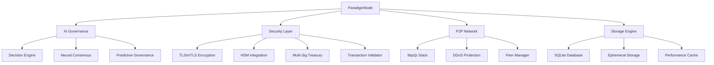

# 🚀 Paradigm Advanced Developer Guide

[](#) [](https://rustup.rs/) [](#security-features)

**Complete developer guide for building on the Paradigm AI-driven cryptocurrency platform**

---

## 📋 Table of Contents

- [Architecture Overview](#-architecture-overview)
- [Security Features](#-security-features)
- [AI Systems](#-ai-systems)
- [Network Protocol](#-network-protocol)
- [Development Setup](#-development-setup)
- [API Reference](#-api-reference)
- [Smart Contracts](#-smart-contracts)
- [Testing](#-testing)
- [Deployment](#-deployment)

---

## 🏗️ Architecture Overview

### Core Components



### Module Structure

| Component | Location | Purpose |
|-----------|----------|---------|
| **AI Governance** | `src/ai/` | Autonomous network decisions |
| **Security Layer** | `src/secure_*`, `src/*_security.rs` | Enterprise security |
| **Consensus** | `src/consensus.rs` | Proof-of-Work + AI validation |
| **Networking** | `src/network.rs`, `src/peer_manager.rs` | P2P communications |
| **Storage** | `src/storage.rs` | High-performance data layer |
| **Tokenomics** | `src/tokenomics/` | Economic models and analytics |

---

## 🔒 Security Features

### 1. TLS/mTLS Encryption

**Location**: `src/secure_networking.rs`

```rust
// Initialize secure communications
let mut secure_net = SecureNetworking::new(SecurityLevel::MutualTLS)?;
secure_net.initialize_tls().await?;
```

**Security Levels**:
- `None`: Development only
- `TLS`: Standard encryption
- `MutualTLS`: Enterprise-grade bidirectional auth

### 2. Hardware Security Module (HSM) Integration

**Location**: `src/hsm_manager.rs`

```rust
// Connect to HSM for key management
let hsm_config = HSMConfig {
    hsm_type: HSMType::AWS_CloudHSM,
    connection_string: "cluster-xyz:2225".to_string(),
    // ... other config
};

let hsm_manager = HSMManager::new(hsm_config).await?;
let key_id = hsm_manager.generate_key(
    KeyType::Private,
    CryptoAlgorithm::Ed25519,
    "transaction-signing".to_string(),
    vec![KeyUsage::Sign, KeyUsage::Verify]
).await?;
```

**Supported HSMs**:
- PKCS#11 hardware modules
- AWS CloudHSM
- Azure Key Vault HSM
- YubiKey hardware tokens
- Ledger hardware wallets
- Software HSM (development)

### 3. Multi-Signature Treasury Wallets

**Location**: `src/multisig_treasury.rs`

```rust
// Create enterprise treasury wallet
let wallet_id = node.create_treasury_wallet(
    "Main Treasury".to_string(),
    TreasuryWalletType::MainTreasury,
    3, // Require 3 of 5 signatures
    vec![
        WalletSigner {
            signer_id: Uuid::new_v4(),
            public_key: cfo_public_key.to_bytes().to_vec(),
            name: "CFO".to_string(),
            role: SignerRole::TreasuryManager,
            weight: 2, // Weighted voting
            is_active: true,
            last_signed: None,
        },
        // ... more signers
    ]
).await?;

// Propose transaction requiring multiple approvals
let tx_id = node.propose_treasury_transaction(
    wallet_id,
    transaction,
    proposer_id
).await?;
```

### 4. AI-Driven Dynamic Fee Calculation

**Location**: `src/fee_calculation.rs`

```rust
// Calculate optimal fees using AI governance
let fee_result = node.calculate_transaction_fee(
    amount,
    sender_address,
    false // not urgent
).await?;

println!("Base fee: {:.8} PAR", fee_result.base_fee as f64 / 1e8);
println!("Congestion adjustment: {:.8} PAR", fee_result.congestion_adjustment as f64 / 1e8);
println!("Near-zero optimization: {:.8} PAR", fee_result.contributor_incentive as f64 / 1e8);
println!("Total fee: {:.8} PAR ({:.4}%)", 
    fee_result.total_fee as f64 / 1e8,
    fee_result.fee_percentage * 100.0
);
```

**Fee Optimization Features**:
- Near-zero fees for micro-transactions (<1 PAR)
- Progressive reduction for small amounts (<10 PAR)
- Network congestion awareness
- Contributor reward balancing
- Anti-spam absolute minimums (0.0001 PAR)

---

## 🤖 AI Systems

### 1. AI Governance Engine

**Location**: `src/ai/decision_engine.rs`

```rust
// AI-powered network decisions
let decision_engine = AIDecisionEngine::new();
let context = DecisionContext {
    network_state: current_network_state,
    recent_transactions: last_1000_transactions,
    governance_proposals: pending_proposals,
};

let ai_decision = decision_engine.make_governance_decision(context).await?;
println!("AI Decision: {:?}", ai_decision.decision_type);
println!("Confidence: {:.2}%", ai_decision.confidence * 100.0);
```

### 2. Neural Consensus System

**Location**: `src/ai/neural_consensus.rs`

```rust
// Consensus through neural network validation
let neural_consensus = NeuralConsensusEngine::new();
neural_consensus.submit_vote(VoteData {
    validator_id: node_id,
    vote_value: 0.87, // Confidence in transaction validity
    reasoning: "High confidence based on transaction pattern analysis".to_string(),
    timestamp: Utc::now(),
}).await?;

// Get consensus result
let consensus = neural_consensus.get_consensus(proposal_id).await?;
if consensus.reached && consensus.confidence > 0.75 {
    // Execute proposal
}
```

### 3. Predictive Governance

**Location**: `src/ai/predictive_governance.rs`

```rust
// Predict network needs and auto-adjust parameters
let predictor = PredictiveGovernance::new();
let predictions = predictor.analyze_network_trends(
    historical_data,
    current_metrics
).await?;

for prediction in predictions.parameter_adjustments {
    println!("Predicted adjustment: {} -> {}", 
        prediction.parameter, prediction.recommended_value);
}
```

---

## 🌐 Network Protocol

### P2P Communication

**Location**: `src/network.rs`

```rust
// Initialize P2P network with libp2p
let mut network = P2PNetwork::new(node_id).await?;
network.start_listening().await?;

// Broadcast transaction to network
network.broadcast_transaction(&transaction).await?;

// Handle incoming messages
while let Some(event) = network.next_event().await {
    match event {
        NetworkMessage::Transaction(tx) => handle_transaction(tx).await?,
        NetworkMessage::MLTask(task) => process_ml_task(task).await?,
        // ... other message types
    }
}
```

### Peer Management

**Location**: `src/peer_manager.rs`

```rust
// Add bootstrap peers for network discovery
let peer_manager = node.peer_manager.read().await;
peer_manager.add_bootstrap_peer("192.168.1.100:8080".to_string()).await?;

// Get network health metrics
let stats = peer_manager.get_network_stats().await;
println!("Active peers: {}", stats.active_peers);
println!("Bootstrap peers: {}", stats.bootstrap_peers);
println!("Network quality: {:.1}%", stats.average_quality_score * 100.0);
```

---

## 💾 Storage Engine

### High-Performance Database

**Location**: `src/storage.rs`

```rust
// Initialize optimized storage
let storage = ParadigmStorage::new_with_config(
    "sqlite:///path/to/paradigm.db",
    StorageConfig {
        max_connections: 32,
        cache_ttl_seconds: 300,
        enable_wal_mode: true,
        enable_mmap: true,
    }
).await?;

// Store transaction with caching
storage.store_transaction(&transaction).await?;

// Query with performance cache
let balance = storage.get_balance(&address).await?;
```

### Ephemeral Storage

**Location**: `src/ephemeral_storage.rs`

```rust
// High-speed temporary data storage
let ephemeral = node.ephemeral_storage.read().await;
ephemeral.store_transaction(&pending_transaction).await?;

// Auto-cleanup after confirmation
let confirmed_transactions = ephemeral.get_confirmed_transactions().await?;
```

---

## 🔧 Development Setup

### Prerequisites

```bash
# Install Rust (minimum 1.75)
curl --proto '=https' --tlsv1.2 -sSf https://sh.rustup.rs | sh

# Install protobuf compiler (optional, for gRPC)
# Windows: Download from https://protobuf.dev/downloads/
# Linux: sudo apt install protobuf-compiler
# macOS: brew install protobuf

# Clone repository
git clone https://github.com/paradigm-network/paradigm.git
cd paradigm
```

### Build Configuration

**Fast Development Build**:
```bash
# Windows
build.bat

# Linux/macOS  
cargo build --release
```

**Production Build with All Features**:
```bash
# Windows
build-advanced.bat

# Linux/macOS
cargo build --release --all-features
```

### Environment Setup

Create `.env` file:
```env
# Database configuration
DATABASE_URL=sqlite://./paradigm-data/paradigm.db

# Network configuration
PARADIGM_PORT=8080
API_PORT=8080

# Security configuration  
SECURITY_LEVEL=TLS
HSM_ENABLED=false

# AI configuration
AI_GOVERNANCE_ENABLED=true
NEURAL_CONSENSUS_ENABLED=true
```

---

## 📡 API Reference

### REST API Endpoints

**Base URL**: `http://localhost:8080/api/v1/`

#### Transactions
```bash
# Submit transaction
POST /transactions
{
  "from": "PAR1a2b3c4d5e6f7g8h9i0j1k2l3m4n5o6p7q8r9s0",
  "to": "PAR9s8r7q6p5o4n3m2l1k0j9i8h7g6f5e4d3c2b1a0",
  "amount": 1000000000,  # 10 PAR in smallest units
  "message": "hello"
}

# Get transaction status
GET /transactions/{transaction_id}

# Get fee estimation
POST /transactions/estimate-fee
{
  "amount": 1000000000,
  "urgent": false
}
```

#### Network Status
```bash
# Get network health
GET /network/status

# Get peer information  
GET /network/peers

# Get sync status
GET /network/sync
```

#### AI Governance
```bash
# Get AI governance parameters
GET /governance/parameters

# Submit governance proposal
POST /governance/proposals
{
  "title": "Adjust minimum fee",
  "description": "Reduce minimum fee to 0.0001 PAR",
  "proposal_type": "ParameterChange",
  "changes": {
    "min_fee_percentage": 0.000001
  }
}
```

### WebSocket API

```javascript
// Connect to real-time updates
const ws = new WebSocket('ws://localhost:8080/ws');

ws.onmessage = (event) => {
  const data = JSON.parse(event.data);
  switch(data.type) {
    case 'transaction':
      console.log('New transaction:', data.transaction);
      break;
    case 'block':
      console.log('New block:', data.block);
      break;
    case 'governance_decision':
      console.log('AI governance decision:', data.decision);
      break;
  }
};
```

---

## 🧪 Testing

### Unit Tests

```bash
# Run all tests
cargo test

# Run specific module tests
cargo test --package paradigm-core ai::
cargo test --package paradigm-core security::
cargo test --package paradigm-core storage::

# Run with logging
RUST_LOG=debug cargo test
```

### Integration Tests

```bash
# Network integration tests
cargo test --test network_integration

# Security integration tests  
cargo test --test security_integration

# AI system tests
cargo test --test ai_governance_integration
```

### Load Testing

```bash
# Start test network
test-network.bat  # Windows
./test-network.sh # Linux/macOS

# Run load tests with paradigm-wallet
paradigm-wallet stress-test 1000
```

---

## 🚀 Deployment

### Local Development Network

```bash
# Start genesis node
paradigm-core --data-dir ./genesis-data --genesis genesis-config.toml --enable-api

# Connect additional nodes
paradigm-core --data-dir ./node-2 --addnode 127.0.0.1:8080
```

### Production Deployment

**Docker Deployment**:
```dockerfile
FROM rust:1.75 as builder
WORKDIR /app
COPY . .
RUN cargo build --release --all-features

FROM debian:bookworm-slim
RUN apt-get update && apt-get install -y ca-certificates
COPY --from=builder /app/target/release/paradigm-core /usr/local/bin/
EXPOSE 8080
CMD ["paradigm-core", "--data-dir", "/data", "--enable-api"]
```

**Kubernetes Deployment**:
```yaml
apiVersion: apps/v1
kind: Deployment
metadata:
  name: paradigm-node
spec:
  replicas: 3
  selector:
    matchLabels:
      app: paradigm-node
  template:
    metadata:
      labels:
        app: paradigm-node
    spec:
      containers:
      - name: paradigm-core
        image: paradigm/core:latest
        ports:
        - containerPort: 8080
        env:
        - name: SECURITY_LEVEL
          value: "MutualTLS"
        - name: HSM_ENABLED  
          value: "true"
        volumeMounts:
        - name: data
          mountPath: /data
      volumes:
      - name: data
        persistentVolumeClaim:
          claimName: paradigm-data
```

---

## 📊 Performance Monitoring

### Built-in Metrics

```rust
// Access performance metrics
let metrics = node.get_network_health_score().await;
println!("Network health: {:.1}%", metrics * 100.0);

// Fee calculation metrics
let (low_fee, normal_fee, high_fee) = node.estimate_fee_range(amount).await?;
println!("Fee range: {:.8} - {:.8} PAR", 
    low_fee as f64 / 1e8, high_fee as f64 / 1e8);

// Transaction throughput
let stats = storage.get_performance_stats().await?;
println!("TPS: {:.1}", stats.transactions_per_second);
```

### External Monitoring

**Prometheus Integration**:
```yaml
# Add to prometheus.yml
scrape_configs:
  - job_name: 'paradigm-nodes'
    static_configs:
      - targets: ['localhost:8080']
    metrics_path: '/metrics'
```

**Grafana Dashboard**: Import dashboard from `monitoring/grafana-dashboard.json`

---

## 🔗 Integration Examples

### Payment Integration

```rust
use paradigm_core::{ParadigmNode, NodeConfig, Address, Amount};

async fn process_payment(
    node: &ParadigmNode,
    from: &str,
    to: &str, 
    amount_par: f64
) -> Result<String> {
    let from_addr = Address::from_string(from)?;
    let to_addr = Address::from_string(to)?;
    let amount: Amount = (amount_par * 1e8) as u64;
    
    // Calculate optimal fee
    let fee_result = node.calculate_transaction_fee(amount, &from_addr, false).await?;
    
    // Create transaction
    let transaction = Transaction {
        id: Uuid::new_v4(),
        from: from_addr,
        to: to_addr,
        amount,
        fee: fee_result.total_fee,
        timestamp: Utc::now(),
        signature: Vec::new(), // Will be signed by wallet
        nonce: get_nonce(&from_addr).await?,
        message: None,
    };
    
    // Submit to network
    node.submit_transaction(transaction.clone()).await?;
    
    Ok(transaction.id.to_string())
}
```

### DeFi Integration

```rust
// Smart contract-like functionality using AI governance
async fn create_liquidity_pool(
    node: &ParadigmNode,
    token_a: &str,
    token_b: &str,
    initial_liquidity_a: Amount,
    initial_liquidity_b: Amount
) -> Result<String> {
    let proposal = GovernanceProposal {
        title: format!("Create {}/{} Liquidity Pool", token_a, token_b),
        proposal_type: ProposalType::LiquidityPool,
        parameters: json!({
            "token_a": token_a,
            "token_b": token_b,
            "initial_liquidity_a": initial_liquidity_a,
            "initial_liquidity_b": initial_liquidity_b,
            "fee_rate": 0.003 // 0.3%
        }),
    };
    
    // AI governance will evaluate and potentially approve
    let proposal_id = node.submit_governance_proposal(proposal).await?;
    
    Ok(proposal_id.to_string())
}
```

---

## 🛡️ Security Best Practices

### Key Management
- Always use HSM for production key storage
- Implement key rotation policies
- Use multi-signature for high-value operations
- Never log private keys or sensitive data

### Network Security
- Enable mTLS for production deployments
- Use DDoS protection settings
- Implement proper firewall rules
- Monitor peer reputation scores

### Transaction Security
- Validate all inputs client-side and server-side
- Use formal transaction validation rules
- Implement rate limiting per address
- Monitor for unusual transaction patterns

### AI Governance Security
- Review AI decisions before critical changes
- Implement human oversight for major proposals
- Monitor AI confidence levels
- Use neural consensus for validation

---

## 📚 Additional Resources

- **API Documentation**: [docs/API.md](./API.md)
- **Security Guide**: [docs/SECURITY.md](./SECURITY.md)
- **Deployment Guide**: [docs/DEPLOYMENT.md](./DEPLOYMENT.md)
- **Contributing Guidelines**: [docs/CONTRIBUTING.md](./CONTRIBUTING.md)

---

## 🆘 Support & Community

- **Issues**: [GitHub Issues](https://github.com/paradigm-network/paradigm/issues)
- **Discord**: [Join Developer Community](https://discord.gg/paradigm-dev)
- **Documentation**: [docs.paradigm.network](https://docs.paradigm.network)
- **Stack Overflow**: Tag `paradigm-cryptocurrency`

---

**Built with ❤️ by the Paradigm Core Team**