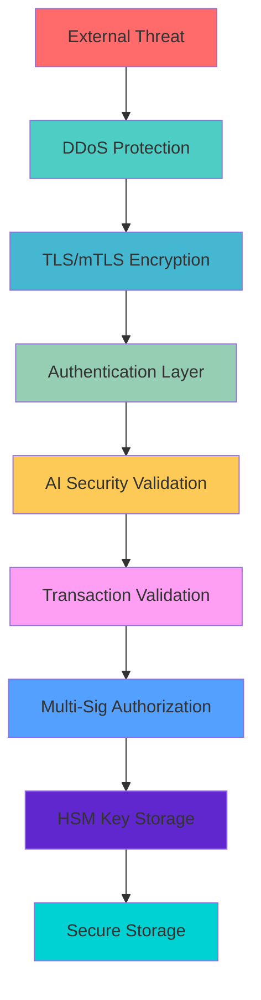

# 🛡️ Paradigm Security Guide

[](#) [](#) [](#)

**Comprehensive security implementation guide for Paradigm cryptocurrency**

---

## 📋 Table of Contents

- [Security Architecture](#-security-architecture)
- [TLS/mTLS Encryption](#-tlsmtls-encryption)
- [Hardware Security Modules](#-hardware-security-modules)
- [Multi-Signature Treasury](#-multi-signature-treasury)
- [AI-Driven Security](#-ai-driven-security)
- [Transaction Validation](#-transaction-validation)
- [DDoS Protection](#-ddos-protection)
- [Key Management](#-key-management)
- [Security Best Practices](#-security-best-practices)
- [Compliance & Auditing](#-compliance--auditing)

---

## 🏗️ Security Architecture

### Multi-Layered Security Model



### Security Levels

| Level | Description | Use Case | Features |
|-------|-------------|----------|----------|
| **None** | No encryption | Development only | ⚠️ Local testing only |
| **TLS** | Transport encryption | Standard deployment | 🔒 Encrypted communication |
| **MutualTLS** | Bidirectional auth | Enterprise deployment | 🔐 Certificate-based authentication |

---

## 🔒 TLS/mTLS Encryption

### Configuration

**Basic TLS Setup:**
```bash
# Start with TLS encryption
paradigm-core --security-level TLS --enable-api
```

**Enterprise mTLS Setup:**
```toml
# network-config.toml
[security]
level = "MutualTLS"
cert_dir = "./certs"
ca_cert = "ca.pem"
server_cert = "server.pem"
server_key = "server.key"
client_cert = "client.pem"
client_key = "client.key"
```

### Certificate Management

**Generate Self-Signed Certificates (Development):**
```bash
# Create certificate directory
mkdir certs && cd certs

# Generate CA private key
openssl genrsa -out ca.key 4096

# Generate CA certificate
openssl req -new -x509 -days 365 -key ca.key -out ca.pem \
  -subj "/C=US/ST=State/L=City/O=Paradigm/CN=Paradigm-CA"

# Generate server private key
openssl genrsa -out server.key 4096

# Generate server certificate signing request
openssl req -new -key server.key -out server.csr \
  -subj "/C=US/ST=State/L=City/O=Paradigm/CN=paradigm-node"

# Sign server certificate
openssl x509 -req -days 365 -in server.csr -CA ca.pem -CAkey ca.key \
  -CAcreateserial -out server.pem
```

**Production Certificate Deployment:**
```rust
use paradigm_core::secure_networking::{SecureNetworking, SecurityLevel};

let mut secure_net = SecureNetworking::new(SecurityLevel::MutualTLS)?;
secure_net.initialize_tls().await?;

// Certificate auto-rotation
secure_net.enable_auto_rotation(Duration::from_days(30)).await?;
```

---

## 🔐 Hardware Security Modules

### Supported HSM Types

| HSM Type | Production Ready | Key Features |
|----------|------------------|--------------|
| **AWS CloudHSM** | ✅ | FIPS 140-2 Level 3, Global availability |
| **Azure Key Vault HSM** | ✅ | FIPS 140-2 Level 2, Azure integration |
| **PKCS#11 Hardware** | ✅ | Universal standard, On-premise |
| **YubiKey** | ⚠️ | Portable, Development/Testing |
| **Ledger** | ⚠️ | Hardware wallet, Individual use |
| **Software HSM** | ❌ | Development only |

### AWS CloudHSM Configuration

**1. Setup AWS CloudHSM:**
```bash
# Create CloudHSM cluster
aws cloudhsmv2 create-cluster \
  --hsm-type hsm1.medium \
  --subnet-ids subnet-12345 subnet-67890

# Initialize cluster
aws cloudhsmv2 initialize-cluster \
  --cluster-id cluster-xyz \
  --signed-cert file://customerCA.crt \
  --trust-anchor file://customerCA.crt
```

**2. Paradigm Configuration:**
```toml
# network-config.toml
[hsm]
enabled = true
hsm_type = "AWS_CloudHSM"
connection_string = "cluster-xyz.cloudhsm.us-east-1.amazonaws.com:2225"
credentials = "./aws-hsm-credentials.json"
key_label_prefix = "paradigm"
auto_failover = true
```

**3. Integration Code:**
```rust
use paradigm_core::hsm_manager::{HSMManager, HSMConfig, HSMType};

let hsm_config = HSMConfig {
    hsm_type: HSMType::AWS_CloudHSM,
    connection_string: "cluster-xyz.cloudhsm.region.amazonaws.com:2225".to_string(),
    credentials_path: Some("./aws-hsm-credentials.json".to_string()),
    // ... other config
};

let hsm_manager = HSMManager::new(hsm_config).await?;

// Generate signing key in HSM
let key_id = hsm_manager.generate_key(
    KeyType::Private,
    CryptoAlgorithm::Ed25519,
    "transaction-signing".to_string(),
    vec![KeyUsage::Sign, KeyUsage::Verify]
).await?;

// Sign transaction with HSM-stored key
let signature = hsm_manager.sign_data(&key_id, transaction_data).await?;
```

### Azure Key Vault HSM

**Configuration:**
```toml
[hsm]
enabled = true
hsm_type = "Azure_HSM"
connection_string = "https://your-keyvault.vault.azure.net/"
credentials = "./azure-credentials.json"
tenant_id = "your-tenant-id"
client_id = "your-client-id"
```

---

## 🏦 Multi-Signature Treasury

### Enterprise Treasury Setup

**1. Create Treasury Wallet:**
```rust
use paradigm_core::multisig_treasury::{TreasuryWalletType, WalletSigner, SignerRole};

let signers = vec![
    WalletSigner {
        signer_id: Uuid::new_v4(),
        public_key: cfo_public_key.to_bytes().to_vec(),
        name: "CFO".to_string(),
        role: SignerRole::TreasuryManager,
        weight: 3, // Higher weight for senior roles
        is_active: true,
        last_signed: None,
    },
    WalletSigner {
        signer_id: Uuid::new_v4(),
        public_key: ceo_public_key.to_bytes().to_vec(),
        name: "CEO".to_string(),
        role: SignerRole::TreasuryManager,
        weight: 3,
        is_active: true,
        last_signed: None,
    },
    WalletSigner {
        signer_id: Uuid::new_v4(),
        public_key: board_member_key.to_bytes().to_vec(),
        name: "Board Member".to_string(),
        role: SignerRole::AuditOversight,
        weight: 1,
        is_active: true,
        last_signed: None,
    }
];

let treasury_id = node.create_treasury_wallet(
    "Corporate Treasury".to_string(),
    TreasuryWalletType::MainTreasury,
    5, // Require 5 weight units (e.g., CFO + CEO = 6, sufficient)
    signers
).await?;
```

**2. Transaction Approval Workflow:**
```rust
// 1. Propose transaction
let tx_id = node.propose_treasury_transaction(
    treasury_id,
    transaction,
    proposer_id
).await?;

// 2. Multiple parties sign
node.sign_treasury_transaction(tx_id, cfo_id, &cfo_signing_key).await?;
node.sign_treasury_transaction(tx_id, ceo_id, &ceo_signing_key).await?;

// 3. Execute when threshold met
let executed_tx = node.execute_treasury_transaction(tx_id).await?;
```

### Security Policies

**Time-Limited Proposals:**
- Transactions expire after 24 hours by default
- Emergency transactions can have shorter timeouts
- Audit trail maintains complete history

**Role-Based Access Control:**
```rust
pub enum SignerRole {
    TreasuryManager,    // Full access to treasury operations
    NetworkGovernor,    // Network parameter changes
    EmergencyRecovery,  // Emergency fund access only
    AuditOversight,     // View and audit permissions
    TechnicalLead,      // Technical parameter changes
}
```

---

## 🤖 AI-Driven Security

### Neural Consensus Security

**Threat Detection:**
```rust
use paradigm_core::ai::neural_consensus::NeuralConsensusEngine;

let neural_consensus = NeuralConsensusEngine::new();

// Submit transaction for AI validation
let ai_validation = neural_consensus.validate_transaction_security(
    &transaction,
    &network_context
).await?;

if ai_validation.threat_level > 0.8 {
    // High threat detected - require additional validation
    return Err("Transaction flagged by AI security system");
}
```

**Adaptive Security Levels:**
- **Low Risk**: Standard validation
- **Medium Risk**: Additional human review required
- **High Risk**: Multi-factor authentication + manual approval

### Predictive Security

**Anomaly Detection:**
```rust
// AI monitors transaction patterns in real-time
let anomaly_score = ai_security.analyze_transaction_pattern(&transaction).await?;

if anomaly_score > 0.9 {
    // Potential attack detected
    ai_security.trigger_security_alert(AlertLevel::High).await?;
    
    // Temporarily increase validation requirements
    ai_security.escalate_security_level(Duration::from_hours(1)).await?;
}
```

---

## ✅ Transaction Validation

### Formal Validation Rules

**Rule Categories:**
1. **Signature Validation**: Cryptographic signature verification
2. **Balance Validation**: Sufficient funds + fees
3. **Format Validation**: Proper transaction structure
4. **Temporal Validation**: Timestamp and nonce checking
5. **Rate Limit Validation**: Anti-spam protection
6. **Policy Validation**: Business rule compliance
7. **Network Validation**: Network-specific rules
8. **Risk Validation**: AI-driven risk assessment

**Configuration:**
```rust
use paradigm_core::transaction_validation::{TransactionValidator, ValidationRule};

let validator = TransactionValidator::new(NetworkValidationConfig {
    network_id: "paradigm-mainnet".to_string(),
    chain_id: 1,
    min_fee: 10_000, // 0.0001 PAR
    max_transaction_age_hours: 24,
    max_future_timestamp_minutes: 5,
    rate_limit_per_address: 100, // per hour
    enable_risk_scoring: true,
    require_ai_validation: true,
    ..Default::default()
}).await?;

// Validate transaction
let result = validator.validate_transaction(
    &transaction,
    sender_balance,
    &sender_public_key
).await?;

if !result.is_valid {
    return Err(format!("Transaction validation failed: {:?}", result.errors));
}
```

---

## 🛡️ DDoS Protection

### Rate Limiting

**IP-Based Protection:**
```rust
use paradigm_core::ddos_protection::{DDoSProtection, RequestType};

let ddos_protection = DDoSProtection::new();

// Check if request is allowed
if !ddos_protection.is_request_allowed(
    client_ip,
    RequestType::Transaction,
    1 // request count
).await? {
    return Err("Rate limit exceeded");
}
```

**Configuration:**
```toml
[ddos_protection]
enabled = true
max_requests_per_minute = 60
max_requests_per_hour = 1000
ban_duration_minutes = 15
whitelist_ips = ["192.168.1.0/24", "10.0.0.0/8"]
```

### Advanced Protection

**Behavioral Analysis:**
- Pattern recognition for attack identification
- Adaptive rate limits based on network conditions
- Automatic IP reputation scoring
- Geographic request analysis

---

## 🔑 Key Management

### Best Practices

**Key Generation:**
```rust
// Use HSM for production keys
let signing_key = if hsm_enabled {
    hsm_manager.generate_key(KeyType::Private, CryptoAlgorithm::Ed25519, "main-signing", uses).await?
} else {
    // Software key for development only
    SigningKey::generate(&mut OsRng)
};
```

**Key Rotation:**
```rust
// Automatic key rotation every 90 days
let key_rotation_policy = KeyRotationPolicy {
    rotation_interval: Duration::from_days(90),
    overlap_period: Duration::from_days(7),
    max_key_age: Duration::from_days(365),
    require_hsm: true,
};

hsm_manager.enable_auto_rotation(key_rotation_policy).await?;
```

**Key Backup and Recovery:**
- HSM-based key backup to multiple geographic locations
- Secure key escrow for emergency recovery
- Multi-party key reconstruction (Shamir's Secret Sharing)

---

## 📋 Security Best Practices

### Development Security

**Code Security:**
- [ ] No hardcoded secrets or keys
- [ ] All user input validated and sanitized
- [ ] Proper error handling without information leakage
- [ ] Regular dependency updates and vulnerability scanning
- [ ] Code review for all security-related changes

**Testing Security:**
```bash
# Security testing
cargo audit                          # Vulnerability scanning
cargo test security::                # Security-specific tests
cargo test --test security_integration  # Integration tests

# Load testing with security focus
python paradigm-network.py test --stress --security-enabled
```

### Production Security

**Network Security:**
- [ ] Enable TLS/mTLS encryption
- [ ] Configure proper firewall rules
- [ ] Use HSM for all key operations
- [ ] Enable DDoS protection
- [ ] Monitor network traffic and anomalies

**Operational Security:**
- [ ] Regular security assessments
- [ ] Incident response plan
- [ ] Backup and disaster recovery procedures
- [ ] Security monitoring and alerting
- [ ] Staff security training

**Infrastructure Security:**
```bash
# Secure node deployment
paradigm-core \
  --security-level MutualTLS \
  --enable-hsm \
  --hsm-config production-hsm.toml \
  --enable-ddos-protection \
  --audit-log /secure/logs/audit.log \
  --data-dir /encrypted/data \
  --cert-dir /secure/certs
```

---

## 📊 Compliance & Auditing

### Audit Logging

**Comprehensive Logging:**
```rust
// All security events are logged
audit_logger.log_security_event(SecurityEvent {
    event_type: SecurityEventType::TransactionValidated,
    timestamp: Utc::now(),
    user_id: Some(transaction.from.to_string()),
    ip_address: client_ip,
    success: validation_result.is_valid,
    details: json!({
        "transaction_id": transaction.id,
        "validation_rules_applied": validation_result.rules_checked,
        "risk_score": validation_result.risk_score,
    }),
}).await?;
```

**Log Categories:**
- Authentication events
- Transaction validations
- Key operations
- Network security events
- AI governance decisions
- Multi-signature operations

### Compliance Features

**Regulatory Compliance:**
- **AML/KYC Integration**: API hooks for compliance services
- **Transaction Monitoring**: Real-time suspicious activity detection
- **Audit Trails**: Immutable logs of all security operations
- **Data Privacy**: GDPR-compliant data handling
- **Reporting**: Automated compliance report generation

**Example Compliance Integration:**
```rust
// AML/KYC check before transaction processing
let aml_result = compliance_service.check_aml(
    &transaction.from,
    &transaction.to,
    transaction.amount
).await?;

if aml_result.risk_level == RiskLevel::High {
    // Require manual review
    compliance_service.flag_for_review(
        transaction.id,
        "High AML risk detected"
    ).await?;
    
    return Err("Transaction requires compliance review");
}
```

---

## 🆘 Security Incident Response

### Incident Response Plan

**1. Detection and Analysis**
```rust
// Automated threat detection
if security_monitor.detect_threat().await? {
    incident_response.initiate_response(ThreatLevel::High).await?;
    
    // Immediate containment
    network_security.enable_defensive_mode().await?;
    
    // Alert security team
    alert_system.send_security_alert(
        "Potential security incident detected",
        AlertPriority::Critical
    ).await?;
}
```

**2. Containment and Eradication**
- Automatic threat isolation
- Network traffic filtering
- Suspicious transaction quarantine
- Compromised key rotation

**3. Recovery and Post-Incident**
- System integrity verification
- Service restoration procedures
- Incident documentation
- Security improvement implementation

### Emergency Procedures

**Emergency Shutdown:**
```bash
# Emergency network shutdown (requires multi-sig authorization)
paradigm-core emergency-shutdown \
  --reason "Security incident detected" \
  --authority-key emergency-key.pem \
  --require-multisig 3-of-5
```

**Key Compromise Response:**
```rust
// Immediate key rotation in case of compromise
emergency_response.rotate_compromised_key(
    compromised_key_id,
    EmergencyRotationReason::SecurityBreach
).await?;

// Notify all network participants
broadcast_security_alert(SecurityAlert::KeyCompromise {
    key_id: compromised_key_id,
    replacement_key_id: new_key_id,
    effective_timestamp: Utc::now(),
}).await?;
```

---

## 📞 Security Contact

**Security Team:**
- **Email**: security@paradigm.network
- **PGP Key**: Available at keybase.io/paradigm_security
- **Emergency**: +1-XXX-XXX-XXXX (24/7 security hotline)

**Bug Bounty Program:**
- **Scope**: All security-related vulnerabilities
- **Rewards**: Up to $10,000 for critical vulnerabilities
- **Submission**: security-reports@paradigm.network

---

**🛡️ Security is our highest priority. This guide will be updated as new features and threats emerge.**

*Last updated: January 2024*